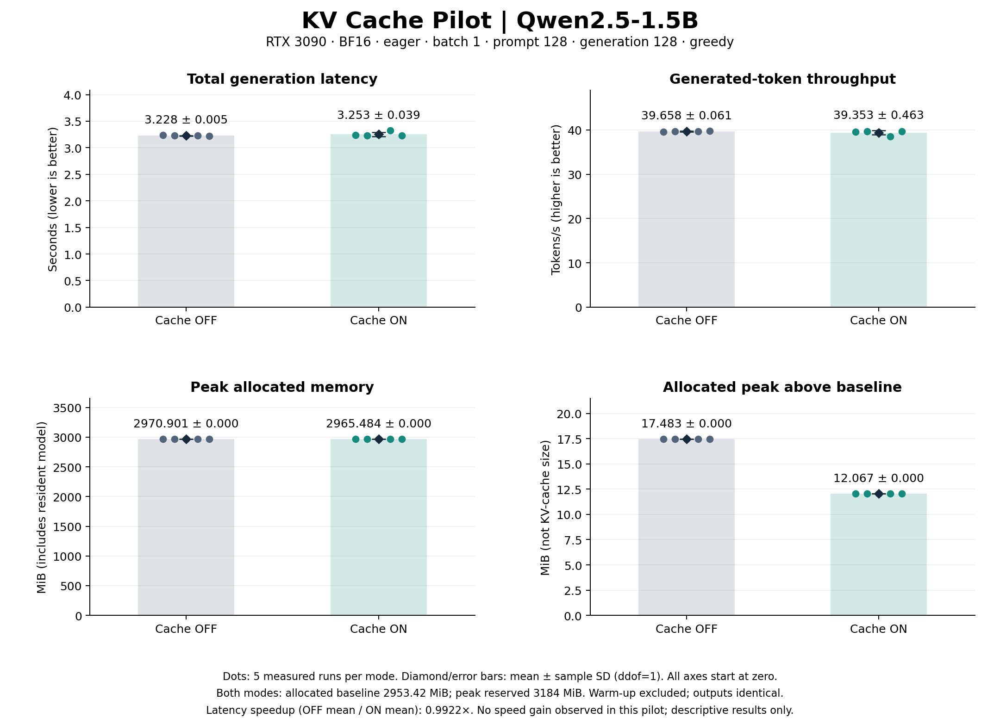
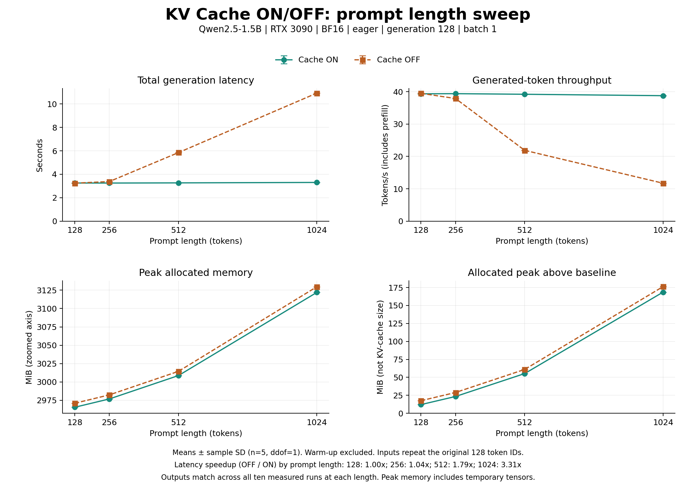
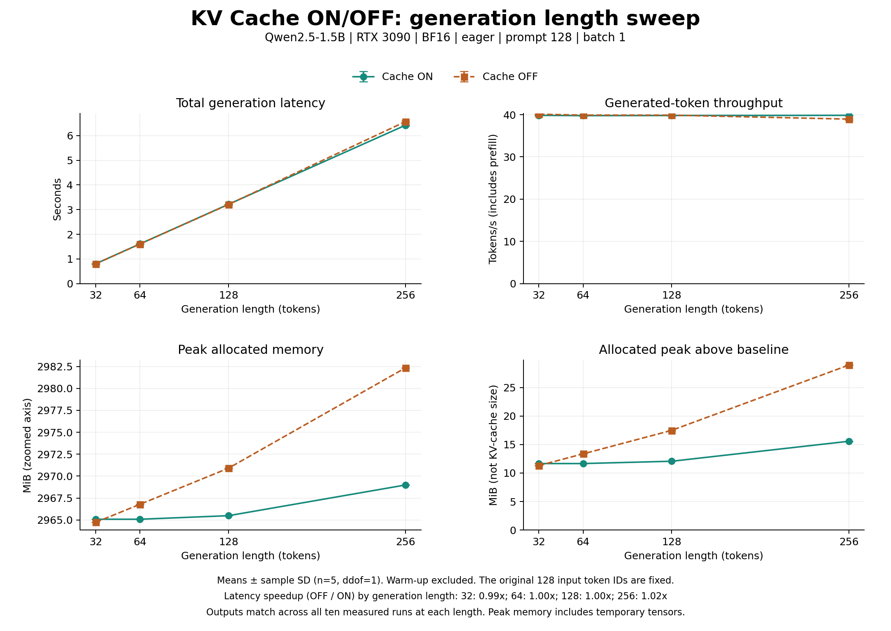

# KV Cache 파일럿 실험

Qwen2.5-1.5B에서 KV Cache ON/OFF에 따른 전체 generation latency, throughput, GPU 메모리를 비교하는 개인 실험입니다.
현재 128-token 입력 / 128-token 생성 파일럿의 측정과 검증을 완료했습니다.

## 고정 조건

- 모델: `Qwen/Qwen2.5-1.5B`, revision `8faed761d45a263340a0528343f099c05c9a4323`
- GPU: RTX 3090, BF16, eager attention, batch 1, greedy, seed 42, matmul TF32 off
- 고정 token IDs 128개를 직접 사용하며 재-tokenization하지 않습니다.
- 같은 프로세스에서 warm-up OFF/ON 각 2회 후, 실행 순서를 교대하며 각 5회 측정합니다.
- Python 3.10.12, PyTorch 2.3.1+cu121, Transformers 4.46.3, Accelerate 0.34.2
- VESSL 기본 PyTorch/CUDA 환경을 유지합니다. 나머지 버전은 [requirements.txt](requirements.txt)를 참고하세요.

## 파일럿 결과

평균 ± 표본 표준편차 (`n=5`, `ddof=1`), warm-up 제외:

| 지표 | Cache OFF | Cache ON |
|---|---:|---:|
| Total latency (s) | 3.227592 ± 0.004935 | 3.252939 ± 0.038871 |
| Throughput (tokens/s) | 39.658127 ± 0.060574 | 39.353463 ± 0.463296 |
| Peak allocated (MiB) | 2970.900879 ± 0 | 2965.484375 ± 0 |
| Peak reserved (MiB) | 3184 ± 0 | 3184 ± 0 |

10회 모두 새 토큰 128개를 생성했고, ON/OFF token IDs가 전부 일치했습니다.
Latency speedup (`OFF 평균 / ON 평균`)은 **0.992208×**로 이번 조건에서는 속도 향상이 관측되지 않았습니다.
각 조건 5회에 대한 기술 통계이며 다른 길이의 성능이나 통계적 유의성을 나타내지 않습니다.
Peak allocated에는 모델·임시 tensor도 포함되므로 KV Cache 자체 크기로 해석하지 않습니다.



[PDF 그래프](plots/pilot_results.pdf) · [Raw CSV](results/pilot_raw.csv) ·
[Raw JSON](results/pilot_memory.json) · [검증·통계 JSON](results/pilot_summary.json)

## 재현

기존 환경과 고정 모델 snapshot을 준비한 상태에서 프로젝트 루트에서 실행합니다.
모델은 `models/Qwen2.5-1.5B` 경로로 참조하며 Git에 포함하지 않습니다.
현재 Workspace에서는 이 경로가 `/tmp/kv-cache-project-models/Qwen2.5-1.5B`를 가리키므로,
Workspace 재시작 후에는 실제 파일 존재 여부를 확인해야 합니다.

```bash
# 새 GPU 측정: warm-up 4회 + 본측정 10회, latency/throughput/memory
python -B src/run_pilot.py

# 결과 검증 및 CSV·통계 생성 (GPU 실행 없음)
python -B src/summarize_pilot.py

# PNG/PDF 그래프 생성 (설치된 Matplotlib 사용, 버전은 plot_metadata.json에 기록)
python -B src/plot_pilot.py
```

각 명령은 지정된 결과 파일을 갱신합니다. 분석 스크립트는 측정 당시 설정·코드 해시와 현재 파일의 일치를 검사합니다.
환경 버전이 다르거나 로컬 모델이 없으면 먼저 원인을 확인하세요. 패키지를 일괄 업그레이드하지 않습니다.

- [실험 규격·FP16 → BF16 변경 근거](docs/experiment_spec.md)
- [파일럿 설정](docs/pilot_config.json), [고정 입력](data/shared_5_1_input.json), [모델 출처](docs/model_source.json)
- [환경 기록](results/environment_setup.json), [패키지 버전 고정](requirements.txt), [그래프 출처·버전](results/plot_metadata.json)

단계별 중간 기록은 `results/`에 보존합니다. 최종 통계는 **15단계 `pilot_memory.json`의 10개 표본만** 사용합니다.
첫 확장은 generation=128에서 prompt 길이 128·256·512·1024를 비교하는 실험입니다.
[확장 규격과 실행 명령](docs/prompt_sweep.md)을 참고하세요. 생성 길이 32·64·128·256의 후속 실험 조건은 [generation sweep 문서](docs/generation_sweep.md)를 참고하세요. Prefill/decode 분리와 actual KV 측정은 아래 6개 지표 확장에서 별도로 다룹니다.

## 입력 길이 확장 결과

생성 길이를 128로 유지한 sweep에서 입력 128·256·512·1024의 latency speedup은 각각
**0.996× · 1.039× · 1.793× · 3.311×**였습니다. 길이별 10회 출력 token IDs는 모두 일치했습니다.



[조건과 상세 결과](docs/prompt_sweep.md) · [Raw CSV](results/prompt_sweep_raw.csv) · [통계 JSON](results/prompt_sweep_summary.json)

## 생성 길이 확장 결과

입력 128개를 고정하고 생성 길이를 32·64·128·256으로 바꾼 결과, latency speedup은 각각
**0.993× · 0.997× · 0.998× · 1.023×**였습니다. 각 길이에서 ON/OFF 출력 token IDs는 모두 일치했습니다.
32–128개에서는 시간이 비슷했고, 256개에서 ON의 평균 시간이 약간 짧았습니다.



[조건과 상세 결과](docs/generation_sweep.md) · [Raw CSV](results/generation_sweep_raw.csv) · [통계 JSON](results/generation_sweep_summary.json)

## 두 sweep의 6개 지표

Prefill/decode/total latency, decode throughput, peak allocated memory, 실제 K/V tensor 크기를
수동 greedy 루프로 새로 측정합니다. Prefill은 첫 token까지, decode는 나머지 N−1개 token입니다.
기존 generate 기반 전체 latency 결과와는 별도 표본입니다.

[정의·방법·재현 명령](docs/detailed_sweeps.md) · [측정 설정](docs/detailed_sweeps_config.json)
